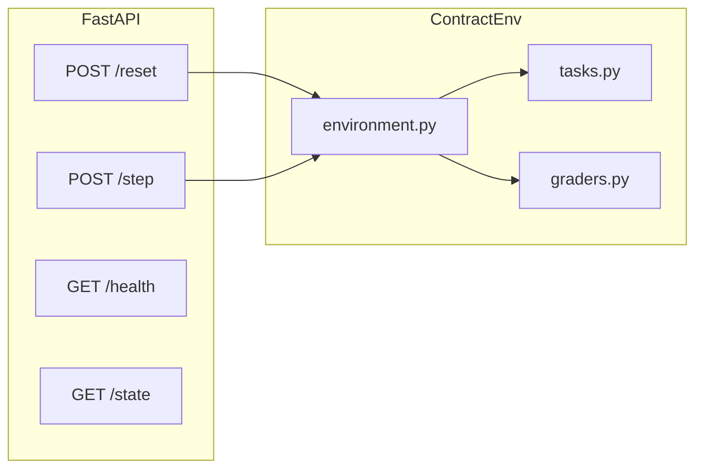

# Contract Negotiation Environment (OpenEnv)

Deterministic, **production-leaning** RL-style environment for multi-step contract negotiation: flag risky clauses, edit language, propose counters, accept or reject. Rewards live in **`[0.0, 1.0]`** with an explicit decomposition (correctness · improvement · risk alignment) returned on each step for observability.

## Why this design

- **Legal realism**: weighted risk phrases, “hidden trap” paragraphs, industry context labels, and simulated **counterparty openings** in `negotiation_history`.
- **Gradable**: every transition exposes structured `reward.metrics` plus `info.grade` for dashboards and ablations.
- **Agent-ready**: reference client ranks actions with the **same grader** the env uses (no train/serve skew for the bundled heuristic).

## Quick start

- **Python 3.10+** (Dockerfile pins 3.10; CI uses 3.10).
- Always set `PYTHONPATH` to the `contract_env` directory.

```bash
cd contract_env
python -m venv .venv
.venv\Scripts\activate   # or source .venv/bin/activate
pip install -r requirements.txt
set PYTHONPATH=%CD%
```

### Run the API

```bash
uvicorn server:app --host 0.0.0.0 --port 7860
```

| Endpoint | Method | Purpose |
|----------|--------|---------|
| `/health` | GET | Liveness (`Dockerfile` HEALTHCHECK) |
| `/state` | GET | Full internal state + serialized task |
| `/reset` | POST | New episode; cycles EASY → MEDIUM → HARD |
| `/step` | POST | `{ "action_type", "content?" }` → observation + reward + `info` |

CORS defaults to `*`; override with comma-separated `CORS_ORIGINS`. Set `DEBUG=1` to include tracebacks in JSON `500` responses.

### Run the reference agent

```bash
set PYTHONPATH=%CD%
set BASE_URL=http://127.0.0.1:7860
set HF_TOKEN=your_hf_token   # optional
python inference.py --episodes 3
```

Heuristic only (no LLM):

```bash
python inference.py --direct
```

**CI / regression sweep** (three tasks, must score mean reward ≥ 0.5 each):

```bash
python inference.py --benchmark
```

The client uses the OpenAI-compatible Hugging Face router:

```python
OpenAI(base_url="https://router.huggingface.co/v1", api_key=os.getenv("HF_TOKEN"))
```

Default model: `Qwen/Qwen2.5-72B-Instruct` (`MODEL_NAME` override). The LLM is invoked only when semantic confidence is low or the action is textual (`EDIT_CLAUSE` / `PROPOSE_COUNTER`).

## Architecture



| Module | Responsibility |
|--------|----------------|
| `env/tasks.py` | Three curated clauses + `industry_context`, `opponent_opening`, trap markers. |
| `env/graders.py` | `evaluate_action` → `Reward` + `info`; `contract_quality_score` for episode summaries. |
| `env/environment.py` | Deterministic cycling, `max_steps=5`, prepends opponent lines, merges grader diagnostics into `info`. |
| `server.py` | HTTP surface, CORS, structured errors. |
| `inference.py` | Greedy policy over action types using `score_action_hypothetical`, optional router LLM, CLI (`--benchmark`, `--episodes`, `--direct`). |

## Action space

`FLAG_RISK`, `EDIT_CLAUSE`, `ACCEPT`, `REJECT`, `PROPOSE_COUNTER`.  
`EDIT_CLAUSE` and `PROPOSE_COUNTER` require non-empty `content` (after strip).

## Reward and risk semantics

- **Composite**: `0.4 · correctness + 0.3 · improvement + 0.3 · risk_alignment`, clipped to `[0, 1]`.
- **Correctness**: weighted keyword hits on the evaluated utterance + token-overlap with the pre-step contract.
- **Improvement**: coverage of `safe_keywords` + overlap with `expected_safe_edit`.
- **Effective high risk** (ACCEPT ⇒ score `0`): HARD unresolved traps; HIGH clauses with material keyword mass; **MODERATE** drafts above a calibrated keyword threshold (previously “looks safe to ACCEPT” loophole).

Each `Reward` includes `metrics` (e.g. `correctness`, `improvement`, `effective_high_risk`). Each `step` `info` carries `grade`, `accept_blocked`, and `trap_unresolved`.

## Docker

```bash
docker build -t contract-negotiation-env .
docker run --rm -p 7860:7860 contract-negotiation-env
```

## Hugging Face Space

Use this folder as a **Docker** Space, expose **7860**, optionally provide `HF_TOKEN` to client machines running `inference.py`.

## OpenEnv

```bash
openenv validate .
openenv validate --url http://127.0.0.1:7860
```

Manifest: `openenv.yaml`.

## Development

```bash
pip install pytest httpx
python -m unittest discover -s tests -v
python inference.py --benchmark
```

GitHub Actions (`.github/workflows/ci.yml`) runs **unittest**, **`inference.py --benchmark`**, and **`docker build`** on pushes/PRs.

## Inference log format

```text
[START] task=<task_name> env=ContractNegotiationEnv model=<model_name>
[STEP] step=<n> action=<action_str> reward=<0.00> done=<true|false> error=<null>
[END] success=<true|false> steps=<n> score=<0.00> quality=<0.00> rewards=<r1,r2,...>
```

`quality` is a static **contract quality** proxy at episode end (not the per-step reward). Use `error=<null>` literally when no error occurred.

## Pre-validation scripts

- Windows: `powershell -ExecutionPolicy Bypass -File scripts/prevalidate.ps1`
- Unix: `bash scripts/prevalidate.sh`

See `CONTRIBUTING.md` for conventions.
